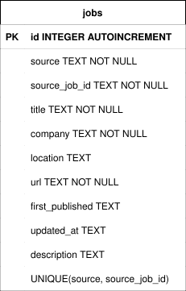

<div align="center"><h1>Jobomation</h1></div>

Jobomation is a local-first tool for discovering, evaluating, and managing job opportunities.

> [!IMPORTANT]
> Jobomation is currently in early development.

## Requirements
- [x] <a target="_blank" href="https://docs.continuum.io/free/anaconda/install">Anaconda</a> **OR** <a target="_blank" href="https://docs.conda.io/projects/miniconda/en/latest">Miniconda</a>

> [!TIP]
> If you have trouble deciding between Anaconda and Miniconda, please refer to the table below:
> <table>
>  <thead>
>   <tr>
>    <th><center>Anaconda</center></th>
>    <th><center>Miniconda</center></th>
>   </tr>
>  </thead>
>  <tbody>
>   <tr>
>    <td>New to conda and/or Python</td>
>    <td>Familiar with conda and/or Python</td>
>   </tr>
>   <tr>
>    <td>Not familiar with using terminal and prefer GUI</td>
>    <td>Comfortable using terminal</td>
>   </tr>
>   <tr>
>    <td>Like the convenience of having Python and 1,500+ scientific packages automatically installed at once</td>
>    <td>Want fast access to Python and the conda commands and plan to sort out the other programs later</td>
>   </tr>
>   <tr>
>    <td>Have the time and space (a few minutes and 3 GB)</td>
>    <td>Don't have the time or space to install 1,500+ packages</td>
>   </tr>
>   <tr>
>    <td>Don't want to individually install each package</td>
>    <td>Don't mind individually installing each package</td>
>   </tr>
>  </tbody>
> </table>
>
> Typing out entire Conda commands can sometimes be tedious, so I wrote a shell script ([`conda_shortcuts.sh`](https://github.com/lynkos/configs/blob/main/Scripts/conda_funcs.sh)) to define shortcuts for commonly used Conda commands.
> <details>
>   <summary>Example: Delete/remove a conda environment named <code>test_env</code></summary>
>
> * Shortcut command
>     ```
>     rmenv test_env
>     ```
> * Manually typing out the entire command
>     ```sh
>     conda env remove -n test_env && rm -rf $(conda info --base)/envs/test_env
>     ```
>
> The shortcut has 80.8% fewer characters!
> </details>

## Installation
1. Confirm conda is installed
   ```
   conda --version
   ```

2. Ensure conda is up to date
   ```
   conda update conda
   ```

3. Enter the directory you want `jobomation` to be cloned in
   ```sh
   cd ~/path/to/directory
   ```

4. Clone and enter `jobomation`
   ```sh
   git clone https://github.com/lynkos/jobomation.git && cd jobomation
   ```

5. Create Conda virtual environment (`job_env`) from [`environment.yml`](environment.yml)
   ```sh
   conda env create -f environment.yml
   ```

6. Activate Conda virtual environment (`job_env`)
   ```sh
   conda activate job_env
   ```

7. (**OPTIONAL**) Install tests
   ```sh
   python -m pip install -e ".[dev]"
   ```

## Usage
Fetch job postings from [targets](config/targets.yml) and add to [SQLite database](data/jobomation.db)
   ```sh
   python -m jobomation.main
   ```

Run dashboard
   ```sh
   python -m jobomation.dashboard.app
   ```

## Testing
For everything:
   ```sh
   pytest -v
   ```

For one subsystem, such as [`models.py`](src/jobomation/models.py):
   ```sh
   pytest tests/test_models.py -v
   ```

## Miscellaneous
### Design Doc
See [Design Doc](DESIGN.md) for more details.

### Database Schema
<div align="center"></div>

### Directory Tree
<details open>
<pre>
.
├── .vscode/
│   └── settings.json
├── assets/
│   ├── pipeline.drawio
│   ├── pipeline.svg
│   ├── schema.drawio
│   └── schema.svg
├── config/
│   ├── filters.yml
│   └── targets.yml
├── data/
│   └── jobomation.db
├── src/
│   └── jobomation/
│       ├── collectors/
│       │   ├── __init__.py
│       │   ├── ashby.py
│       │   ├── greenhouse.py
│       │   ├── indeed.py
│       │   └── utils.py
│       ├── dashboard/
│       │   ├── __init__.py
│       │   └── app.py
│       ├── db/
│       │   ├── __init__.py
│       │   ├── connection.py
│       │   ├── repository.py
│       │   └── schema.py
│       ├── filtering/
│       │   ├── __init__.py
│       │   └── rules.py
│       ├── __init__.py
│       ├── config.py
│       ├── main.py
│       └── models.py
├── tests/
│   ├── conftest.py
│   ├── test_collectors.py
│   ├── test_config.py
│   ├── test_dashboard.py
│   ├── test_database.py
│   ├── test_filtering.py
│   ├── test_main.py
│   └── test_models.py
├── .gitignore
├── DESIGN.md
├── environment.yml
├── LICENSE.md
├── pyproject.toml
└── README.md
</pre>
</details>
