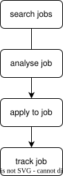

# Jobomation

<div align="center">
  <p>OpenCode plugin for automatic job application.</p>
  
</div>

## Requirements
- [x] OpenCode
- [x] Node.js

## Installation
1. Install OpenCode
  ```sh
  brew install anomalyco/tap/opencode
  ```

2. Install dependencies
   ```sh
   npm install
   npx playwright install
   npm run setup-browser
   npm run build
   ```

## Setup
1. Create file `config/profile.json` and edit accordingly
   ```json
   {
     "name": "YOUR NAME",
     "email": "YOUR_EMAIL@domain.com",
     "phone": "+1 (123) 456-7890",
     "location": "City, State, Country",
     "linkedin": "https://linkedin.com/in/YOUR_USERNAME",
     "github": "https://github.com/YOUR_USERNAME",
     "portfolio": "https://YOUR_WEBSITE.com",
     "resume_path": "/path/to/your/resume.pdf",

     "target": {
       "titles": [
         "Software Engineer",
         "Cloud Engineer",
         "Full Stack Engineer"
       ],
       "min_salary": 80000,
       "max_salary": 300000,
       "remote": true,
       "locations": [
         "City, State",
         "Remote"
       ],
       "exclude_companies": [
         ""
       ],
       "keywords_required": [
         ""
       ],
       "keywords_excluded": [
         ""
       ]
     },

     "experience_years": 1,
     "skills": [
       "Some Skill"
     ],
     "education": "B.S. Computer Science, YOUR UNIVERSITY, GRADUATION SEMESTER AND YEAR",
     "summary": "A brief 2-3 sentence professional summary that will seed cover letter generation.",

     "linkedin_credentials": {
       "_comment": "Used ONLY for LinkedIn Easy Apply. Stored locally, never sent anywhere.",
       "email": "YOUR_EMAIL@domain.com",
       "password": ""
     }
   }
   ```

2. Add the following to your OpenCode config file (`~/.opencode/config.json`)
   ```json
   {
     "mcp": {
       "servers": {
         "jobomation": {
           "command": "node",
           "args": [ "/path/to/jobomation/dist/index.js" ],
           "env": { "ANTHROPIC_API_KEY": "YOUR_ANTHROPIC_API_KEY" }
         }
       }
     }
   }
   ```

## Database Schema
```sql
CREATE TABLE IF NOT EXISTS jobs (
   id          TEXT PRIMARY KEY,          -- Unique job ID (source:externalId)
   title       TEXT NOT NULL,
   company     TEXT NOT NULL,
   location    TEXT,
   url         TEXT NOT NULL,
   description TEXT,
   salary_min  INTEGER,
   salary_max  INTEGER,
   remote      BOOLEAN DEFAULT FALSE CHECK (remote IN (FALSE, TRUE)),
   source      TEXT NOT NULL,             -- "linkedin" | "indeed" | "greenhouse" etc.
   posted_at   TEXT,
   fetched_at  TEXT DEFAULT (datetime('now')),

   -- Scoring
   fit_score   REAL,                      -- 0.0 - 1.0, null = not yet scored
   fit_notes   TEXT,                      -- JSON array of reasons

   -- Application state
   status      TEXT DEFAULT 'new',        -- "new" | "queued" | "applied" | "skipped" | "failed"
   applied_at  TEXT
);
```